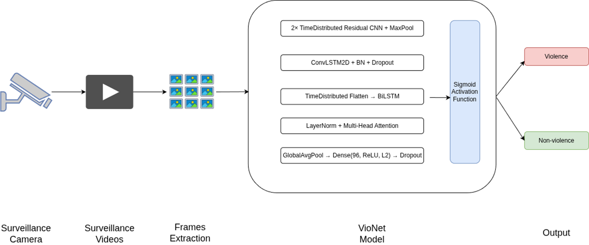

# VioNet: A Hybrid ConvLSTM–BiLSTM–Attention Network for Real-Time Violence Detection




## Introduction

Violence detection in surveillance videos is vital for ensuring public safety. VioNet is a deep hybrid architecture designed for **real-time violence detection** by leveraging spatial, temporal, and contextual information from video clips.

Manual monitoring of video feeds is inconsistent and infeasible at scale. VioNet addresses this challenge using a deep learning-based approach combining **ConvLSTM**, **BiLSTM**, and **Multi-Head Attention** layers to focus on spatio-temporal and sequence-level cues in video data.


## Problem Statement

- Variations in lighting, occlusion, crowd density, and camera angles complicate violence recognition.
- Existing models fail to effectively capture **both** spatial and temporal dynamics.
- VioNet aims to be **fast**, **lightweight**, and **highly accurate** for real-time violence detection.


## Objective

- Detect violent behavior in short surveillance clips using deep learning.
- Introduce a **hybrid model** (ConvLSTM + BiLSTM + Attention).
- Design a system ready for **real-world deployment**, even on low-power edge devices.


## Architecture Overview

VioNet is a hybrid network that processes 20 RGB video frames of size 64×64 using:

- **TimeDistributed Residual CNN Blocks**  
  → Extract spatial features per frame.

- **ConvLSTM2D Layer**  
  → Capture motion patterns across frames.

- **Bidirectional LSTM**  
  → Learn temporal dynamics from both directions.

- **Multi-Head Attention**  
  → Focus on the most informative time steps.

- **GlobalAveragePooling + Dense Head**  
  → Produce a single probability for classification.

### Key Components

| Layer                     | Purpose                                                |
|---------------------------|--------------------------------------------------------|
| `TimeDistributed + ResNet` | Spatial feature extraction per frame                  |
| `ConvLSTM2D`              | Motion encoding (no optical flow needed)              |
| `BiLSTM`                 | Bidirectional temporal learning                       |
| `Multi-Head Attention`    | Contextual relevance across time steps                |
| `GlobalAvgPooling + Dense`| Classification                                        |


## Dataset and Preprocessing

**Dataset**: [Hockey Fight Dataset](http://visilab.etsii.uclm.es/personas/oscar/FightDetection/)

- 500 violent & 500 non-violent videos
- Converted to sequences of 20 frames each using OpenCV
- Frames resized to **64x64**, normalized to `[0,1]`, converted to RGB
- Sequence padding applied to handle varying frame lengths


##  Experimental Setup

| Parameter         | Value                     |
|------------------|---------------------------|
| Framework        | TensorFlow + Keras        |
| Video Processing | OpenCV                    |
| GPU              | Google Colab (Tesla T4)   |
| Epochs           | 50                        |
| Batch Size       | 32                        |
| Optimizer        | Adam                      |
| Loss Function    | Binary Crossentropy       |
| Regularization   | Dropout (0.4), L2 (0.001) |
| Metrics          | Accuracy, F1, AUC-ROC     |


## Results

| Metric          | Score     |
|----------------|-----------|
| **Accuracy**    | 94%       |
| **F1-Score**    | 94%       |
| **AUC-ROC**     | 97%       |

> VioNet demonstrates robustness even in blurry or occluded scenes.

## Folder Structure

The `violence-detection-vionet` project is organized with the following top-level directories: `models` for the VioNet architecture, `utils` for data loaders, trainers, evaluators, and visualizers, `data` to store input videos or extracted frames, `assets` for architecture diagrams and sample outputs, and `plots` for evaluation plots.


---

## Running the Project

1. Clone the repo:
   ```bash
   git clone https://github.com/sarathir-dev/VioNet.git
   cd violence-detection-vionet
   ```
2. Install requirements:
    ```bash
    pip install -r requirements.txt
    ```
3. Train the model:
    ```bash
    python main.py
    ```
4. View plots:
    ```bash
    Open plots/ folder for training curves, confusion matrix, and ROC.
    ```

## Future Work
- Enhance performance in low-light surveillance
- Train on multiple types of violence scenarios
- Optimize for Jetson Nano / Raspberry Pi
